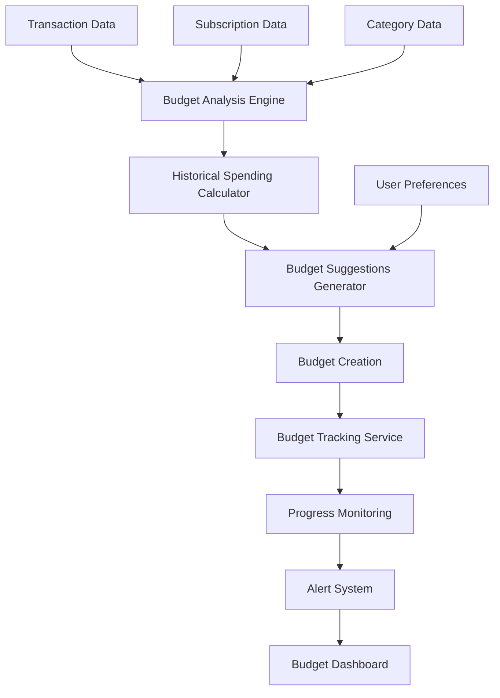

# Design Document

## Overview

The Budget Management feature extends the existing Personal Finance application with comprehensive budgeting capabilities that leverage transaction history, category data, and subscription information. The system provides intelligent budget creation, real-time progress tracking, and analytical insights to help users maintain financial discipline and achieve their spending goals.

The feature integrates seamlessly with the existing data models while introducing new budget-specific entities and business logic that work alongside transaction categorization and subscription tracking.

## Architecture

### System Integration

The budget management system integrates with existing components:

- **Database Layer**: Extends current SQLite schema with budget-related tables
- **Transaction System**: Leverages existing transaction categorization for budget tracking
- **Subscription System**: Integrates subscription costs into budget calculations and projections
- **Category System**: Uses existing category structure for budget organization
- **Analytics Engine**: Builds upon existing financial calculation utilities
- **API Layer**: New budget endpoints alongside existing financial APIs
- **UI Components**: New dashboard and management interfaces using existing design system

### Data Flow



### Core Components

#### 1. Budget Management Service (`budget-service.ts`)

**Purpose**: Core business logic for budget operations
**Responsibilities**:
- Budget CRUD operations
- Budget calculation and validation
- Integration with transaction and subscription data
- Budget performance analysis

```typescript
class BudgetService {
  async createBudget(request: CreateBudgetRequest): Promise<Budget>
  async getBudgetSuggestions(categoryId: string, period: BudgetPeriod): Promise<BudgetSuggestion[]>
  async getBudgetProgress(budgetId: string): Promise<BudgetProgress>
  async analyzeBudgetPerformance(budgetId: string): Promise<BudgetAnalysis>
  async getBudgetsByPeriod(startDate: Date, endDate: Date): Promise<Budget[]>
}
```

#### 2. Budget Analytics Engine (`budget-analytics-engine.ts`)

**Purpose**: Advanced analytics and insights for budget data
**Responsibilities**:
- Historical spending analysis
- Budget performance calculations
- Trend analysis and projections
- Variance analysis

```typescript
class BudgetAnalyticsEngine {
  async analyzeHistoricalSpending(categoryId: string, months: number): Promise<SpendingAnalysis>
  async calculateBudgetVariance(budget: Budget): Promise<VarianceAnalysis>
  async projectBudgetPerformance(budget: Budget): Promise<ProjectionResult>
  async generateSpendingInsights(budgets: Budget[]): Promise<SpendingInsight[]>
}
```

#### 3. Budget Suggestion Generator (`budget-suggestion-generator.ts`)

**Purpose**: Intelligent budget amount suggestions based on historical data
**Responsibilities**:
- Historical data analysis
- Statistical calculations
- Subscription cost integration
- Confidence scoring

```typescript
class BudgetSuggestionGenerator {
  async generateSuggestions(categoryId: string, period: BudgetPeriod): Promise<BudgetSuggestion[]>
  async analyzeSpendingPatterns(transactions: Transaction[]): Promise<SpendingPattern>
  async calculateSubscriptionAllocation(categoryId: string): Promise<SubscriptionAllocation>
}
```

## Data Models

### Budget Entity

```typescript
interface Budget {
  id: string;
  name: string;
  description?: string;
  categoryId: string;
  amount: number;
  currency: string;
  period: BudgetPeriod; // 'monthly' | 'yearly'
  startDate: Date;
  endDate: Date;
  isActive: boolean;
  alertThresholds: number[]; // [50, 75, 90, 100]
  scenarioId?: string;
  createdAt: Date;
  updatedAt: Date;
}

interface BudgetPeriod {
  type: 'monthly' | 'yearly';
  startDate: Date;
  endDate: Date;
}
```

### Budget Progress Entity

```typescript
interface BudgetProgress {
  budgetId: string;
  budget: Budget;
  currentSpent: number;
  remainingAmount: number;
  percentageSpent: number;
  status: BudgetStatus; // 'on-track' | 'at-risk' | 'over-budget'
  projectedSpent: number; // Based on current velocity
  daysRemaining: number;
  averageDailySpend: number;
  subscriptionAllocated: number;
  variableSpent: number;
  lastUpdated: Date;
}

type BudgetStatus = 'on-track' | 'at-risk' | 'over-budget';
```

### Budget Suggestion Entity

```typescript
interface BudgetSuggestion {
  categoryId: string;
  categoryName: string;
  period: BudgetPeriod;
  suggestions: {
    conservative: BudgetAmount; // 10% below average
    moderate: BudgetAmount; // At average
    aggressive: BudgetAmount; // 20% below average
  };
  historicalData: {
    averageSpending: number;
    minSpending: number;
    maxSpending: number;
    standardDeviation: number;
    monthsAnalyzed: number;
  };
  subscriptionCosts: {
    fixedAmount: number;
    subscriptionCount: number;
  };
  confidence: number; // 0-1 based on data quality
}

interface BudgetAmount {
  amount: number;
  reasoning: string;
  confidence: number;
}
```

### Budget Scenario Entity

```typescript
interface BudgetScenario {
  id: string;
  name: string;
  description?: string;
  isActive: boolean;
  budgets: Budget[];
  totalBudgeted: number;
  createdAt: Date;
  updatedAt: Date;
}
```

## Database Schema

### Budgets Table

```sql
CREATE TABLE budgets (
  id TEXT PRIMARY KEY,
  name TEXT NOT NULL,
  description TEXT,
  category_id TEXT NOT NULL,
  amount DECIMAL(10,2) NOT NULL,
  currency TEXT NOT NULL DEFAULT 'NOK',
  period_type TEXT NOT NULL CHECK (period_type IN ('monthly', 'yearly')),
  start_date DATE NOT NULL,
  end_date DATE NOT NULL,
  is_active BOOLEAN NOT NULL DEFAULT 1,
  alert_thresholds TEXT, -- JSON array of threshold percentages
  scenario_id TEXT,
  created_at DATETIME DEFAULT CURRENT_TIMESTAMP,
  updated_at DATETIME DEFAULT CURRENT_TIMESTAMP,
  FOREIGN KEY (category_id) REFERENCES categories(id) ON DELETE CASCADE,
  FOREIGN KEY (scenario_id) REFERENCES budget_scenarios(id) ON DELETE SET NULL
);
```

### Budget Scenarios Table

```sql
CREATE TABLE budget_scenarios (
  id TEXT PRIMARY KEY,
  name TEXT NOT NULL,
  description TEXT,
  is_active BOOLEAN NOT NULL DEFAULT 0,
  created_at DATETIME DEFAULT CURRENT_TIMESTAMP,
  updated_at DATETIME DEFAULT CURRENT_TIMESTAMP
);
```

### Budget Alerts Table

```sql
CREATE TABLE budget_alerts (
  id TEXT PRIMARY KEY,
  budget_id TEXT NOT NULL,
  alert_type TEXT NOT NULL, -- 'threshold' | 'projection' | 'exceeded'
  threshold_percentage INTEGER,
  message TEXT NOT NULL,
  is_read BOOLEAN DEFAULT 0,
  created_at DATETIME DEFAULT CURRENT_TIMESTAMP,
  FOREIGN KEY (budget_id) REFERENCES budgets(id) ON DELETE CASCADE
);
```

## API Endpoints

### Budget Management

- `GET /api/budgets` - List budgets with filtering options
- `GET /api/budgets/{id}` - Get specific budget details
- `POST /api/budgets` - Create new budget
- `PUT /api/budgets/{id}` - Update existing budget
- `DELETE /api/budgets/{id}` - Delete budget

### Budget Analytics

- `GET /api/budgets/{id}/progress` - Get current budget progress
- `GET /api/budgets/{id}/analytics` - Get detailed budget analysis
- `GET /api/budgets/dashboard` - Get budget dashboard data
- `GET /api/budgets/suggestions/{categoryId}` - Get budget suggestions for category

### Budget Scenarios

- `GET /api/budget-scenarios` - List all budget scenarios
- `POST /api/budget-scenarios` - Create new scenario
- `PUT /api/budget-scenarios/{id}/activate` - Activate scenario
- `GET /api/budget-scenarios/{id}/compare` - Compare scenarios

## User Interface Components

### Budget Dashboard (`/budgets`)

**Layout**: Grid-based layout showing budget cards with progress indicators

**Components**:
- Budget overview cards with progress rings
- Monthly/Yearly toggle
- Quick stats: Total budgeted, spent, remaining
- Alert indicators for at-risk budgets
- Quick action buttons (Add Budget, View Analytics)

### Budget Creation/Edit (`/budgets/new`, `/budgets/{id}/edit`)

**Layout**: Form-based interface with intelligent suggestions

**Components**:
- Category selection dropdown
- Budget amount input with suggestions
- Period selector (Monthly/Yearly)
- Date range picker
- Historical spending display
- Alert threshold configuration
- Subscription cost breakdown (if applicable)

### Budget Analytics (`/budgets/analytics`)

**Layout**: Multi-panel analytics dashboard

**Components**:
- Spending vs. Budget charts
- Variance analysis graphs
- Historical performance trends
- Category comparison charts
- Projection visualizations
- Insight cards with recommendations

## Business Logic

### Budget Calculation Algorithm

1. **Historical Analysis**:
   - Analyze transactions for selected category over 3, 6, and 12 months
   - Exclude outlier transactions (>2 standard deviations)
   - Separate subscription costs from variable spending
   - Calculate averages, minimums, maximums, and trends

2. **Suggestion Generation**:
   - Conservative: Average - 10% (with subscription floor)
   - Moderate: Average (with subscription allocation)
   - Aggressive: Average - 20% (with subscription minimum)

3. **Progress Tracking**:
   - Real-time calculation based on transaction updates
   - Velocity-based projection for month-end performance
   - Status determination based on spending rate and remaining time

### Alert System

**Threshold Alerts**:
- Trigger when spending crosses user-defined thresholds
- Default thresholds: 50%, 75%, 90%, 100%

**Projection Alerts**:
- Early warning when current spending velocity indicates budget overrun
- Calculated using daily average spending rate

**Anomaly Alerts**:
- Large single transactions that significantly impact budget (>10% of budget)
- Unusual spending spikes compared to historical patterns

## Integration Points

### Transaction System Integration

- Real-time budget updates when transactions are imported/categorized
- Automatic subscription allocation when subscription transactions are flagged
- Historical data analysis using existing transaction repository

### Subscription System Integration

- Automatic budget allocation for subscription costs
- Projection calculations incorporating known recurring payments
- Subscription change impact analysis on budget performance

### Category System Integration

- Budget organization based on existing category structure
- Category-based spending analysis and suggestions
- Hierarchical budget rollup for parent/child categories

## Performance Considerations

### Caching Strategy

- Cache budget progress calculations (5-minute TTL)
- Cache historical analysis results (daily refresh)
- Cache suggestion calculations (weekly refresh)

### Database Optimization

- Indexes on budget queries (category_id, period, is_active)
- Materialized views for common analytics queries
- Periodic cleanup of historical alert data

### Real-time Updates

- Incremental budget progress updates on transaction changes
- Efficient bulk calculations for dashboard rendering
- Background processing for complex analytics calculations