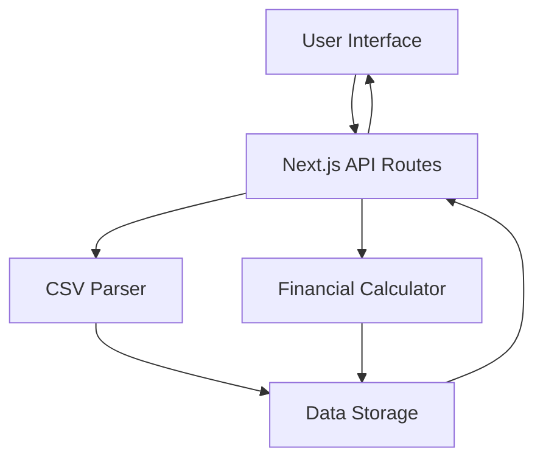

# Design Document

## Overview

The CSV Finance Tracker is a Next.js application that processes bank CSV files and displays financial summaries. The application uses Bun as the package manager and task runner, shadcn/ui for components, and focuses on a clean, modern interface for financial data visualization.

## Architecture

The application follows a typical Next.js architecture with the following key layers:

- **Frontend Layer**: React components using shadcn/ui for the user interface
- **API Layer**: Next.js API routes for CSV processing and data handling
- **Data Layer**: In-memory storage for the initial version (can be extended to persistent storage later)
- **Processing Layer**: CSV parsing and financial calculation utilities



## Components and Interfaces

### Core Components

1. **FileUpload Component**

    - Handles CSV file selection and upload
    - Provides drag-and-drop functionality
    - Shows upload progress and validation feedback
    - Uses shadcn/ui Button and Input components

2. **FinancialSummary Component**

    - Displays total income and expenses
    - Shows formatted currency values
    - Uses shadcn/ui Card components for layout
    - Responsive design for different screen sizes

3. **Layout Component**
    - Provides consistent page structure
    - Includes navigation and branding
    - Uses shadcn/ui layout components

### API Interfaces

1. **POST /api/upload**

    - Accepts CSV file uploads
    - Returns processed transaction data
    - Handles validation and error responses

2. **GET /api/summary**
    - Returns financial summary data
    - Calculates totals from stored transactions

### Data Interfaces

```typescript
interface Transaction {
	id: string;
	date: Date;
	description: string;
	amount: number;
	type: 'income' | 'expense';
}

interface FinancialSummary {
	totalIncome: number;
	totalExpenses: number;
	netAmount: number;
	transactionCount: number;
}
```

## Data Models

### Transaction Model

- **id**: Unique identifier for each transaction
- **date**: Transaction date parsed from CSV
- **description**: Transaction description/memo
- **amount**: Transaction amount (positive for income, negative for expenses)
- **type**: Categorized as 'income' or 'expense' based on amount

### CSV Processing Model

- Assumes standard bank CSV format with columns: Date, Description, Amount (but in norwegian as well, so Bokføringsdato, Beløp and Tittel, maybe also Valuta)
- Flexible parsing to handle different CSV formats
- Data validation and sanitization
- Error handling for malformed data

## Error Handling

### File Upload Errors

- Invalid file format (non-CSV)
- File size limitations
- Corrupted or unreadable files
- Network upload failures

### CSV Processing Errors

- Missing required columns
- Invalid date formats
- Non-numeric amount values
- Empty or malformed rows

### Display Errors

- No data available states
- Calculation errors
- Network connectivity issues

Error responses follow a consistent format:

```typescript
interface ErrorResponse {
	error: string;
	message: string;
	details?: any;
}
```

## Testing Strategy

### Unit Tests

- CSV parsing functions
- Financial calculation utilities
- Component rendering and interactions
- API route handlers

### Integration Tests

- File upload workflow
- End-to-end CSV processing
- API integration with frontend components

### Test Tools

- Jest for unit testing
- React Testing Library for component tests
- Supertest for API testing
- Bun test runner integration

### Test Data

- Sample CSV files with various formats
- Edge cases (empty files, malformed data)
- Different transaction types and amounts

## Technology Stack

- **Framework**: Next.js 14 with App Router
- **Package Manager**: Bun
- **UI Components**: shadcn/ui with Tailwind CSS
- **CSV Processing**: Built-in parsing or papaparse library
- **TypeScript**: For type safety
- **Testing**: Jest + React Testing Library

## File Structure

```
├── app/
│   ├── api/
│   │   ├── upload/
│   │   └── summary/
│   ├── components/
│   │   ├── ui/ (shadcn components)
│   │   ├── FileUpload.tsx
│   │   ├── FinancialSummary.tsx
│   │   └── Layout.tsx
│   ├── lib/
│   │   ├── csv-parser.ts
│   │   ├── financial-calculator.ts
│   │   └── utils.ts
│   ├── page.tsx
│   └── layout.tsx
├── public/
├── package.json
├── tailwind.config.js
├── components.json (shadcn config)
└── bun.lockb
```
