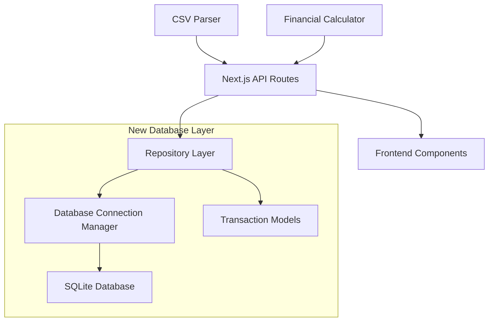

# Design Document

## Overview

The SQLite Persistence feature adds a robust database layer to the CSV Finance Tracker, replacing the current in-memory storage with persistent SQLite database storage. This design leverages Bun's built-in SQLite support for optimal performance and simplicity, implementing a repository pattern for clean separation of concerns and maintainable database operations.

## Architecture

The persistence layer introduces a new database tier while maintaining the existing API structure. The architecture follows a layered approach with clear separation between the API layer, business logic, and data persistence.



### Key Architectural Decisions

1. **Bun SQLite Integration**: Use Bun's native `bun:sqlite` module for optimal performance and zero additional dependencies
2. **Repository Pattern**: Abstract database operations behind a clean interface for testability and maintainability
3. **Connection Pooling**: Implement connection lifecycle management for efficient resource usage
4. **Schema Migrations**: Support database schema evolution with migration scripts

## Components and Interfaces

### Database Schema

```sql
-- Transactions table with proper indexing for performance
CREATE TABLE transactions (
    id TEXT PRIMARY KEY,
    date TEXT NOT NULL,
    description TEXT NOT NULL,
    amount REAL NOT NULL,
    type TEXT NOT NULL CHECK (type IN ('income', 'expense')),
    created_at TEXT DEFAULT CURRENT_TIMESTAMP,
    updated_at TEXT DEFAULT CURRENT_TIMESTAMP
);

-- Indexes for common query patterns
CREATE INDEX idx_transactions_date ON transactions(date);
CREATE INDEX idx_transactions_type ON transactions(type);
CREATE INDEX idx_transactions_amount ON transactions(amount);

-- Unique constraint to prevent duplicates
CREATE UNIQUE INDEX idx_transactions_unique ON transactions(date, description, amount);

-- Metadata table for schema versioning
CREATE TABLE schema_metadata (
    version INTEGER PRIMARY KEY,
    applied_at TEXT DEFAULT CURRENT_TIMESTAMP
);
```

### Repository Interface

```typescript
interface TransactionRepository {
	// Core CRUD operations
	create(transaction: Omit<Transaction, 'id'>): Promise<Transaction>;
	createMany(transactions: Omit<Transaction, 'id'>[]): Promise<Transaction[]>;
	findAll(): Promise<Transaction[]>;
	findById(id: string): Promise<Transaction | null>;
	findByDateRange(startDate: Date, endDate: Date): Promise<Transaction[]>;

	// Business logic operations
	calculateSummary(): Promise<FinancialSummary>;
	checkDuplicates(transactions: Omit<Transaction, 'id'>[]): Promise<string[]>;

	// Database management
	initialize(): Promise<void>;
	close(): Promise<void>;
}
```

### Database Connection Manager

```typescript
interface DatabaseManager {
	getConnection(): Database;
	initialize(): Promise<void>;
	runMigrations(): Promise<void>;
	close(): Promise<void>;
	isHealthy(): Promise<boolean>;
}
```

## Data Models

### Enhanced Transaction Model

The existing Transaction interface remains unchanged for API compatibility, but the database layer adds metadata fields:

```typescript
interface DatabaseTransaction extends Transaction {
	createdAt: Date;
	updatedAt: Date;
}
```

### Migration Model

```typescript
interface Migration {
	version: number;
	description: string;
	up: (db: Database) => void;
	down: (db: Database) => void;
}
```

### Database Configuration

```typescript
interface DatabaseConfig {
	filename: string;
	readonly: boolean;
	create: boolean;
	strict: boolean;
	timeout: number;
}
```

## Error Handling

### Database-Specific Error Types

```typescript
enum DatabaseErrorType {
	CONNECTION_FAILED = 'CONNECTION_FAILED',
	MIGRATION_FAILED = 'MIGRATION_FAILED',
	CONSTRAINT_VIOLATION = 'CONSTRAINT_VIOLATION',
	TRANSACTION_FAILED = 'TRANSACTION_FAILED',
	DUPLICATE_ENTRY = 'DUPLICATE_ENTRY',
}

interface DatabaseError extends Error {
	type: DatabaseErrorType;
	query?: string;
	params?: any[];
}
```

### Error Recovery Strategies

1. **Connection Failures**: Retry with exponential backoff, fallback to in-memory storage if persistent failure
2. **Constraint Violations**: Detect duplicates and provide user feedback
3. **Transaction Failures**: Rollback and retry with smaller batches
4. **Migration Failures**: Log detailed error and prevent application startup

## Testing Strategy

### Unit Tests

-   Repository operations with in-memory SQLite database
-   Migration scripts with test databases
-   Connection manager lifecycle
-   Error handling scenarios

### Integration Tests

-   End-to-end CSV upload with database persistence
-   Multiple file uploads with duplicate detection
-   Database recovery scenarios
-   Performance tests with large datasets

### Test Database Setup

```typescript
// Test helper for isolated database testing
export function createTestDatabase(): Database {
	return new Database(':memory:');
}

export async function seedTestData(db: Database, transactions: Transaction[]): Promise<void> {
	// Seed test data helper
}
```

## Performance Considerations

### Query Optimization

1. **Indexing Strategy**: Indexes on date, type, and amount for common query patterns
2. **Batch Operations**: Use database transactions for bulk inserts
3. **Connection Reuse**: Single connection instance with proper lifecycle management
4. **Query Caching**: Cache frequently accessed summary calculations

### Memory Management

1. **Streaming Results**: Use iterators for large result sets
2. **Connection Pooling**: Proper connection cleanup and resource management
3. **Prepared Statements**: Reuse prepared statements for repeated queries

## File Structure

```
src/
├── lib/
│   ├── database/
│   │   ├── connection.ts          # Database connection manager
│   │   ├── migrations/            # Schema migration files
│   │   │   ├── 001_initial.ts
│   │   │   └── index.ts
│   │   ├── repository.ts          # Transaction repository implementation
│   │   ├── types.ts              # Database-specific types
│   │   └── __tests__/            # Database layer tests
│   │       ├── connection.test.ts
│   │       ├── repository.test.ts
│   │       └── migrations.test.ts
│   ├── types.ts                  # Existing types (unchanged)
│   └── ...
├── app/api/
│   ├── upload/route.ts           # Updated to use repository
│   └── summary/route.ts          # Updated to use repository
└── ...
```

## Migration Strategy

### Database Initialization

1. Check if database file exists
2. Create database with initial schema if new
3. Run pending migrations if existing
4. Verify schema integrity

### Schema Evolution

```typescript
// Migration example
export const migration001: Migration = {
	version: 1,
	description: 'Initial schema creation',
	up: (db: Database) => {
		db.exec(`
            CREATE TABLE transactions (
                id TEXT PRIMARY KEY,
                date TEXT NOT NULL,
                description TEXT NOT NULL,
                amount REAL NOT NULL,
                type TEXT NOT NULL CHECK (type IN ('income', 'expense')),
                created_at TEXT DEFAULT CURRENT_TIMESTAMP,
                updated_at TEXT DEFAULT CURRENT_TIMESTAMP
            );
        `);
	},
	down: (db: Database) => {
		db.exec('DROP TABLE transactions;');
	},
};
```

## Security Considerations

1. **SQL Injection Prevention**: Use parameterized queries exclusively
2. **File Permissions**: Ensure database file has appropriate access controls
3. **Input Validation**: Validate all data before database operations
4. **Error Information**: Avoid exposing sensitive database details in error messages

## Deployment Considerations

1. **Database Location**: Store database in appropriate directory based on environment
2. **Backup Strategy**: Implement database backup for production deployments
3. **Monitoring**: Add health checks for database connectivity
4. **Logging**: Comprehensive logging for database operations and errors
