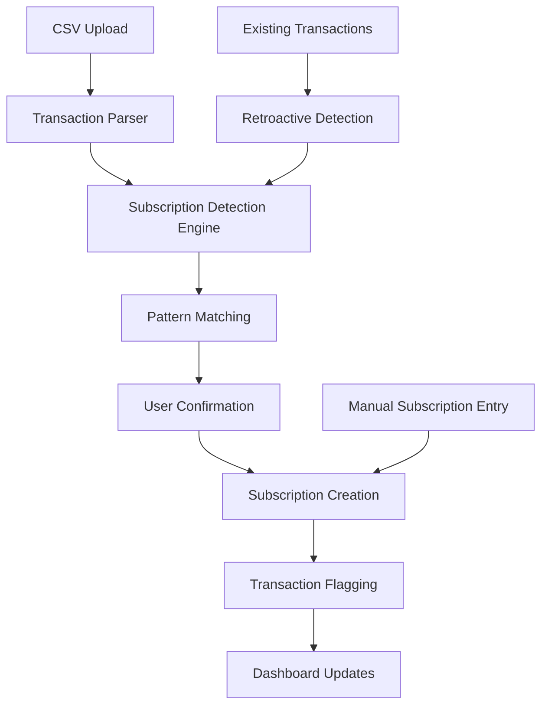

# Design Document

## Overview

The Subscription Tracker feature extends the existing CSV Finance Tracker with intelligent subscription detection, management, and financial projection capabilities. The system leverages the existing transaction and categorization infrastructure while adding a new subscription layer that works seamlessly with current functionality.

The feature introduces subscription-specific data models, detection algorithms, and analytical tools that help users understand the long-term financial impact of their recurring payments. It maintains the existing categorization system by using an `isSubscription` boolean flag rather than replacing categories.

## Architecture

### System Integration

The subscription tracker integrates with existing components:

- **Database Layer**: Extends current SQLite schema with subscription-related tables
- **Transaction System**: Adds subscription flagging to existing transaction model
- **Categorization Engine**: Leverages existing category system for subscription classification
- **API Layer**: New subscription endpoints alongside existing transaction APIs
- **UI Components**: New dashboard and management interfaces using existing design system

### Data Flow



## Components and Interfaces

### 1. Data Models

#### Subscription Model

```typescript
interface Subscription {
	id: string;
	name: string;
	description?: string;
	amount: number;
	currency: string;
	billingFrequency: 'monthly' | 'quarterly' | 'annually' | 'custom';
	customFrequencyDays?: number;
	nextPaymentDate: Date;
	categoryId: string;
	isActive: boolean;
	startDate: Date;
	endDate?: Date;
	notes?: string;
	website?: string;
	cancellationUrl?: string;
	lastUsedDate?: Date;
	usageRating?: number; // 1-5 scale
	createdAt: Date;
	updatedAt: Date;
}
```

#### Subscription Detection Pattern

```typescript
interface SubscriptionPattern {
	id: string;
	subscriptionId: string;
	pattern: string;
	patternType: 'exact' | 'contains' | 'starts_with' | 'regex';
	confidenceScore: number;
	createdBy: 'user' | 'system';
	isActive: boolean;
}
```

#### Enhanced Transaction Model

```typescript
interface TransactionWithSubscription extends Transaction {
	isSubscription: boolean;
	subscriptionId?: string;
	subscription?: Subscription;
}
```

### 2. Subscription Detection Engine

#### Core Detection Algorithm

```typescript
class SubscriptionDetectionEngine {
	async detectSubscriptions(transactions: Transaction[]): Promise<SubscriptionCandidate[]>;
	async analyzeRecurringPatterns(transactions: Transaction[]): Promise<RecurringPattern[]>;
	async matchExistingSubscriptions(transactions: Transaction[]): Promise<SubscriptionMatch[]>;
	async suggestNewSubscriptions(patterns: RecurringPattern[]): Promise<SubscriptionSuggestion[]>;
}
```

#### Pattern Analysis

- **Frequency Detection**: Identifies monthly, quarterly, and annual patterns
- **Amount Consistency**: Detects transactions with consistent amounts (±5% tolerance)
- **Description Matching**: Uses fuzzy matching for vendor name variations
- **Date Pattern Recognition**: Identifies regular payment dates with some flexibility

### 3. Financial Projection Engine

#### Investment Calculator

```typescript
class InvestmentProjectionEngine {
	calculateCompoundReturns(
		monthlyAmount: number,
		annualRate: number,
		years: number,
	): ProjectionResult;

	compareSubscriptionVsInvestment(
		subscription: Subscription,
		projectionYears: number[],
		annualReturnRate: number,
	): ComparisonResult;
}
```

#### Long-term Cost Analysis

```typescript
interface ProjectionResult {
	subscriptionCost: {
		oneYear: number;
		fiveYears: number;
		tenYears: number;
		twentyYears: number;
	};
	investmentValue: {
		oneYear: number;
		fiveYears: number;
		tenYears: number;
		twentyYears: number;
	};
	potentialSavings: {
		oneYear: number;
		fiveYears: number;
		tenYears: number;
		twentyYears: number;
	};
}
```

### 4. Repository Layer

#### Subscription Repository

```typescript
interface SubscriptionRepository {
	// CRUD operations
	create(subscription: Omit<Subscription, 'id'>): Promise<Subscription>;
	findAll(): Promise<Subscription[]>;
	findById(id: string): Promise<Subscription | null>;
	findByCategory(categoryId: string): Promise<Subscription[]>;
	update(id: string, updates: Partial<Subscription>): Promise<Subscription | null>;
	delete(id: string): Promise<boolean>;

	// Subscription-specific queries
	findActiveSubscriptions(): Promise<Subscription[]>;
	findUpcomingPayments(days: number): Promise<Subscription[]>;
	calculateTotalMonthlyCost(): Promise<number>;
	findUnusedSubscriptions(daysSinceLastUse: number): Promise<Subscription[]>;

	// Pattern management
	createPattern(pattern: Omit<SubscriptionPattern, 'id'>): Promise<SubscriptionPattern>;
	findPatternsBySubscription(subscriptionId: string): Promise<SubscriptionPattern[]>;

	// Transaction integration
	flagTransactionAsSubscription(transactionId: string, subscriptionId: string): Promise<void>;
	findSubscriptionTransactions(subscriptionId: string): Promise<Transaction[]>;
}
```

### 5. API Endpoints

#### Subscription Management

- `GET /api/subscriptions` - List all subscriptions with filtering
- `POST /api/subscriptions` - Create new subscription
- `GET /api/subscriptions/:id` - Get subscription details
- `PUT /api/subscriptions/:id` - Update subscription
- `DELETE /api/subscriptions/:id` - Delete subscription

#### Detection and Analysis

- `POST /api/subscriptions/detect` - Detect subscriptions from transactions
- `GET /api/subscriptions/dashboard` - Dashboard summary data
- `GET /api/subscriptions/projections/:id` - Financial projections for subscription
- `POST /api/subscriptions/bulk-categorize` - Bulk categorize detected subscriptions

#### Notifications and Insights

- `GET /api/subscriptions/upcoming` - Upcoming payments
- `GET /api/subscriptions/unused` - Potentially unused subscriptions
- `GET /api/subscriptions/insights` - Cost analysis and recommendations

### 6. UI Components

#### Dashboard Components

- **SubscriptionOverview**: Total monthly/annual costs, active count
- **UpcomingPayments**: Next 30 days payment calendar
- **CostBreakdown**: Spending by category with subscription highlighting
- **ProjectionCharts**: Long-term cost visualization
- **UnusedSubscriptionAlerts**: Recommendations for review

#### Management Components

- **SubscriptionList**: Sortable, filterable list with actions
- **SubscriptionForm**: Create/edit subscription with category integration
- **DetectionWizard**: Guide users through subscription detection process
- **ProjectionCalculator**: Interactive investment comparison tool

## Data Models

### Database Schema Extensions

#### Subscriptions Table

```sql
CREATE TABLE subscriptions (
  id TEXT PRIMARY KEY,
  name TEXT NOT NULL,
  description TEXT,
  amount REAL NOT NULL,
  currency TEXT DEFAULT 'NOK',
  billing_frequency TEXT NOT NULL CHECK (billing_frequency IN ('monthly', 'quarterly', 'annually', 'custom')),
  custom_frequency_days INTEGER,
  next_payment_date TEXT NOT NULL,
  category_id TEXT NOT NULL REFERENCES categories(id),
  is_active BOOLEAN DEFAULT TRUE,
  start_date TEXT NOT NULL,
  end_date TEXT,
  notes TEXT,
  website TEXT,
  cancellation_url TEXT,
  last_used_date TEXT,
  usage_rating INTEGER CHECK (usage_rating BETWEEN 1 AND 5),
  created_at TEXT DEFAULT CURRENT_TIMESTAMP,
  updated_at TEXT DEFAULT CURRENT_TIMESTAMP
);
```

#### Subscription Patterns Table

```sql
CREATE TABLE subscription_patterns (
  id TEXT PRIMARY KEY,
  subscription_id TEXT NOT NULL REFERENCES subscriptions(id) ON DELETE CASCADE,
  pattern TEXT NOT NULL,
  pattern_type TEXT NOT NULL CHECK (pattern_type IN ('exact', 'contains', 'starts_with', 'regex')),
  confidence_score REAL DEFAULT 1.0,
  created_by TEXT NOT NULL CHECK (created_by IN ('user', 'system')),
  is_active BOOLEAN DEFAULT TRUE,
  created_at TEXT DEFAULT CURRENT_TIMESTAMP,
  updated_at TEXT DEFAULT CURRENT_TIMESTAMP
);
```

#### Enhanced Transactions Table

```sql
-- Add subscription fields to existing transactions table
ALTER TABLE transactions ADD COLUMN is_subscription BOOLEAN DEFAULT FALSE;
ALTER TABLE transactions ADD COLUMN subscription_id TEXT REFERENCES subscriptions(id);
```

### Indexes for Performance

```sql
CREATE INDEX idx_subscriptions_active ON subscriptions(is_active);
CREATE INDEX idx_subscriptions_category ON subscriptions(category_id);
CREATE INDEX idx_subscriptions_next_payment ON subscriptions(next_payment_date);
CREATE INDEX idx_subscription_patterns_subscription ON subscription_patterns(subscription_id);
CREATE INDEX idx_transactions_subscription ON transactions(subscription_id);
CREATE INDEX idx_transactions_is_subscription ON transactions(is_subscription);
```

## Error Handling

### Validation Rules

- **Subscription Amount**: Must be positive number
- **Billing Frequency**: Must be valid enum value
- **Next Payment Date**: Must be future date for active subscriptions
- **Category Integration**: Must reference existing category
- **Pattern Validation**: Regex patterns must be valid

### Error Types

```typescript
enum SubscriptionErrorType {
	INVALID_BILLING_FREQUENCY = 'INVALID_BILLING_FREQUENCY',
	DUPLICATE_SUBSCRIPTION = 'DUPLICATE_SUBSCRIPTION',
	INVALID_PROJECTION_PARAMETERS = 'INVALID_PROJECTION_PARAMETERS',
	DETECTION_FAILED = 'DETECTION_FAILED',
	PATTERN_CREATION_FAILED = 'PATTERN_CREATION_FAILED',
}
```

### Error Recovery

- **Detection Failures**: Graceful degradation with manual entry option
- **Projection Errors**: Default to conservative estimates
- **Pattern Matching**: Fallback to simpler matching algorithms
- **Database Constraints**: Clear user feedback with correction suggestions

## Testing Strategy

### Unit Tests

- **Detection Engine**: Test pattern recognition with various transaction formats
- **Projection Calculator**: Verify financial calculations with known inputs
- **Repository Layer**: Test CRUD operations and complex queries
- **API Endpoints**: Test request/response handling and validation

### Integration Tests

- **End-to-End Detection**: Upload CSV → detect subscriptions → create records
- **Category Integration**: Ensure subscription flagging preserves categories
- **Dashboard Data Flow**: Verify data aggregation for dashboard components
- **Transaction Flagging**: Test retroactive subscription identification

### Test Data

- **Sample Subscriptions**: Netflix, Spotify, utilities, gym memberships
- **Recurring Patterns**: Monthly, quarterly, annual with variations
- **Edge Cases**: Irregular amounts, description variations, date shifts
- **Performance Tests**: Large transaction datasets for detection algorithms

### Mocking Strategy

- **External APIs**: Mock any future integrations (subscription databases)
- **Date/Time**: Mock for consistent projection calculations
- **Random Generation**: Mock for deterministic test results
- **Database**: Use in-memory SQLite for fast test execution

### Runtime Compatibility Notes

- **Bun vs Node Testing**: If encountering issues with `bun:sqlite` or Jest/Bun testing incompatibilities due to runtime differences, skip the problematic tests but leave detailed comments explaining the issue and what should be tested
- **SQLite Testing**: For database-related tests that fail in Bun runtime, document the expected behavior and provide manual testing instructions
- **Alternative Testing**: Consider using integration tests or manual verification for components that have Bun/Node runtime conflicts

## Performance Considerations

### Detection Algorithm Optimization

- **Batch Processing**: Process transactions in chunks for large datasets
- **Indexing Strategy**: Optimize database queries for pattern matching
- **Caching**: Cache frequently accessed subscription data
- **Lazy Loading**: Load subscription details on demand

### Projection Calculations

- **Memoization**: Cache calculation results for common scenarios
- **Background Processing**: Calculate projections asynchronously
- **Progressive Enhancement**: Show basic data first, enhance with calculations

### Database Performance

- **Query Optimization**: Use appropriate indexes for subscription queries
- **Connection Pooling**: Reuse database connections efficiently
- **Bulk Operations**: Batch transaction flagging operations

This design provides a comprehensive foundation for implementing the subscription tracking feature while maintaining seamless integration with the existing finance tracker system.
