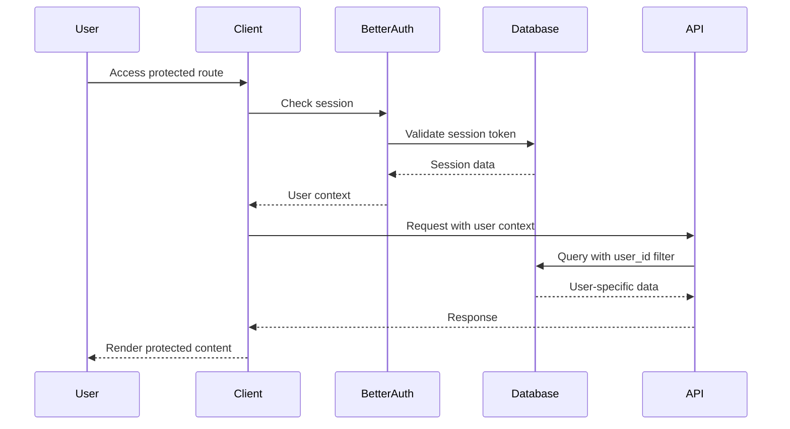
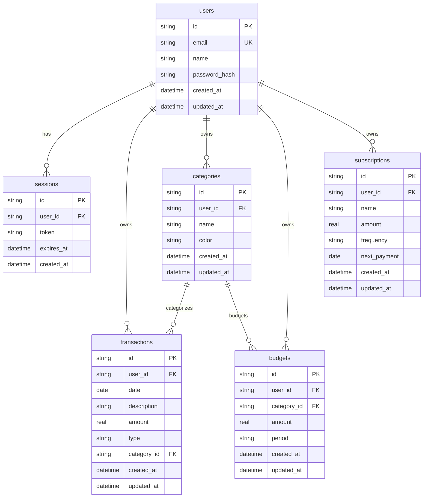

# Design Document

## Overview

This design implements a comprehensive user authentication system using Better Auth, a modern TypeScript-first authentication library. The system will transform the current single-user finance tracker into a multi-tenant application where users can securely register, login, and access only their own financial data.

Better Auth provides built-in support for:

- Email/password authentication
- Session management with secure cookies
- TypeScript-first API with full type safety
- Built-in CSRF protection
- Flexible database adapters
- Server-side and client-side hooks

## Architecture

### Authentication Flow



### Database Schema Changes

The current single-user schema will be extended to support multi-tenancy:



## Components and Interfaces

### Better Auth Configuration

```typescript
// lib/auth.ts
import { betterAuth } from 'better-auth';
import { Database } from 'bun:sqlite';

export const auth = betterAuth({
	database: new Database('./data/finance-tracker.db'),
	emailAndPassword: {
		enabled: true,
		requireEmailVerification: false, // Can be enabled later
	},
	session: {
		expiresIn: 60 * 60 * 24 * 7, // 7 days
		updateAge: 60 * 60 * 24, // 1 day
	},
	advanced: {
		generateId: () => crypto.randomUUID(),
	},
});

export type Session = typeof auth.$Infer.Session;
export type User = typeof auth.$Infer.User;
```

### Authentication Middleware

```typescript
// lib/auth-middleware.ts
import { auth } from './auth';
import { NextRequest, NextResponse } from 'next/server';

export async function withAuth(
	request: NextRequest,
	handler: (request: NextRequest, user: User) => Promise<NextResponse>,
) {
	const session = await auth.api.getSession({
		headers: request.headers,
	});

	if (!session) {
		return NextResponse.json({ error: 'Unauthorized' }, { status: 401 });
	}

	return handler(request, session.user);
}
```

### Client-Side Authentication Hook

```typescript
// hooks/use-auth.ts
import { useAuthClient } from 'better-auth/react';

export const useAuth = () => {
	const { data: session, isPending } = useAuthClient();

	return {
		user: session?.user ?? null,
		isLoading: isPending,
		isAuthenticated: !!session?.user,
	};
};
```

### Database Repository Updates

All repository methods will be updated to include user-based filtering:

```typescript
// lib/database/user-aware-repository.ts
export abstract class UserAwareRepository {
	protected userId: string;

	constructor(userId: string) {
		this.userId = userId;
	}

	protected addUserFilter(query: string): string {
		if (query.toLowerCase().includes('where')) {
			return query.replace(/where/i, `WHERE user_id = '${this.userId}' AND`);
		}
		return `${query} WHERE user_id = '${this.userId}'`;
	}
}

export class UserTransactionRepository extends UserAwareRepository {
	async findAll(): Promise<Transaction[]> {
		const query = this.addUserFilter('SELECT * FROM transactions');
		// Execute query...
	}
}
```

## Data Models

### User Model

```typescript
interface User {
	id: string;
	email: string;
	name: string;
	createdAt: Date;
	updatedAt: Date;
}
```

### Session Model

```typescript
interface Session {
	id: string;
	userId: string;
	token: string;
	expiresAt: Date;
	createdAt: Date;
}
```

### Updated Transaction Model

```typescript
interface Transaction {
	id: string;
	userId: string; // New field
	date: Date;
	description: string;
	amount: number;
	type: 'income' | 'expense' | 'transfer';
	categoryId?: string;
	createdAt: Date;
	updatedAt: Date;
}
```

## Error Handling

### Authentication Errors

```typescript
export enum AuthErrorType {
	INVALID_CREDENTIALS = 'INVALID_CREDENTIALS',
	SESSION_EXPIRED = 'SESSION_EXPIRED',
	EMAIL_ALREADY_EXISTS = 'EMAIL_ALREADY_EXISTS',
	WEAK_PASSWORD = 'WEAK_PASSWORD',
	UNAUTHORIZED_ACCESS = 'UNAUTHORIZED_ACCESS',
}

export class AuthError extends Error {
	constructor(
		public type: AuthErrorType,
		message: string,
		public statusCode: number = 400,
	) {
		super(message);
		this.name = 'AuthError';
	}
}
```

### Error Handling Middleware

```typescript
export function handleAuthError(error: unknown): NextResponse {
	if (error instanceof AuthError) {
		return NextResponse.json(
			{ error: error.message, type: error.type },
			{ status: error.statusCode },
		);
	}

	return NextResponse.json({ error: 'Internal server error' }, { status: 500 });
}
```

## Testing Strategy

### Unit Tests

- Authentication service methods
- Repository user filtering logic
- Middleware authentication checks
- Error handling scenarios

### Integration Tests

- Complete authentication flow (register → login → access protected route)
- Data isolation between users
- Session management and expiration
- Database migration with existing data

### Security Tests

- SQL injection prevention in user-filtered queries
- Session token security
- CSRF protection
- Password strength validation
- Unauthorized access attempts

### Test Data Setup

```typescript
// test/auth-setup.ts
export async function createTestUser(): Promise<User> {
	return auth.api.signUp({
		email: 'test@example.com',
		password: 'TestPassword123!',
		name: 'Test User',
	});
}

export async function authenticateTestUser(): Promise<Session> {
	const user = await createTestUser();
	return auth.api.signIn({
		email: user.email,
		password: 'TestPassword123!',
	});
}
```

## Migration Strategy

### Database Migration Plan

1. **Phase 1**: Add user tables and authentication schema
2. **Phase 2**: Add user_id columns to existing tables
3. **Phase 3**: Create default user for existing data
4. **Phase 4**: Add foreign key constraints
5. **Phase 5**: Update indexes to include user_id

### Data Migration

```typescript
// migrations/008_add_user_support.ts
export const migration008: Migration = {
	version: 8,
	description: 'Add user support and migrate existing data',
	up: (db: any) => {
		// Create users table
		db.exec(`
      CREATE TABLE users (
        id TEXT PRIMARY KEY,
        email TEXT UNIQUE NOT NULL,
        name TEXT NOT NULL,
        password_hash TEXT NOT NULL,
        created_at TEXT DEFAULT CURRENT_TIMESTAMP,
        updated_at TEXT DEFAULT CURRENT_TIMESTAMP
      );
    `);

		// Create sessions table
		db.exec(`
      CREATE TABLE sessions (
        id TEXT PRIMARY KEY,
        user_id TEXT NOT NULL,
        token TEXT UNIQUE NOT NULL,
        expires_at TEXT NOT NULL,
        created_at TEXT DEFAULT CURRENT_TIMESTAMP,
        FOREIGN KEY (user_id) REFERENCES users (id) ON DELETE CASCADE
      );
    `);

		// Add user_id to existing tables
		db.exec('ALTER TABLE transactions ADD COLUMN user_id TEXT;');
		db.exec('ALTER TABLE categories ADD COLUMN user_id TEXT;');
		db.exec('ALTER TABLE budgets ADD COLUMN user_id TEXT;');
		db.exec('ALTER TABLE subscriptions ADD COLUMN user_id TEXT;');

		// Create default user for existing data
		const defaultUserId = crypto.randomUUID();
		db.exec(
			`
      INSERT INTO users (id, email, name, password_hash)
      VALUES (?, 'admin@localhost', 'Default User', 'temp_hash');
    `,
			[defaultUserId],
		);

		// Assign existing data to default user
		db.exec('UPDATE transactions SET user_id = ? WHERE user_id IS NULL;', [defaultUserId]);
		db.exec('UPDATE categories SET user_id = ? WHERE user_id IS NULL;', [defaultUserId]);
		db.exec('UPDATE budgets SET user_id = ? WHERE user_id IS NULL;', [defaultUserId]);
		db.exec('UPDATE subscriptions SET user_id = ? WHERE user_id IS NULL;', [defaultUserId]);

		// Make user_id NOT NULL
		// Note: SQLite doesn't support ALTER COLUMN, so we'd need to recreate tables
		// This will be handled in subsequent migrations
	},
};
```

## Security Considerations

### Password Security

- Better Auth handles password hashing with bcrypt
- Minimum password strength requirements
- Rate limiting on authentication attempts

### Session Security

- Secure HTTP-only cookies
- CSRF token validation
- Session rotation on login
- Automatic session cleanup

### Data Isolation

- All database queries filtered by user_id
- Repository pattern enforces user context
- API middleware validates user access
- Foreign key constraints maintain data integrity

### Input Validation

- Email format validation
- Password complexity requirements
- SQL injection prevention through parameterized queries
- XSS protection through proper escaping
